# B&B CheckIn Webapplicatie
Nederlandstalige webapplicatie die B&B's toelaat hun kamers online te laten aanbieden door een centrale admin en hun eindgebruikers in de gelegenheid stelt deze te bekijken, te filteren en te boeken.

* Deze applicatie werd gemaakt door Bart Van Gucht en Guy Meuris in het kader van hun eindwerk voor de éénjarige, voltijdse dagopleiding "Software Developer .NET" aan het Syntra te Mechelen.

* De B&B CheckIn app bestaat uit drie delen:
  * Server-side: de adminpagina is gemaakt in Blazor_Server
  * ASP.NETCore 5.0 WebApi: afhandeling van de http-calls uit Client-side.
  * Client-side: de front-end pagina's die de eindgebruiker in staat stelt de app te gebruiken en boekingen te realiseren is gemaakt met Blazor_WASM.

* OM de admin te gebruiken dient men ingelogd te zijn met de volgende gegevens: 
  (hardcoded in de UserRolesConfiguration.cs)
  * Email = "bnbadmin@gmail.com",
  * Password = "BbAdmin123+"

---

## Gedetailleerd overzicht van de 3 onderdelen:

### 1. Het dashboard voor de admin

Het inlogscherm van de admin-page:
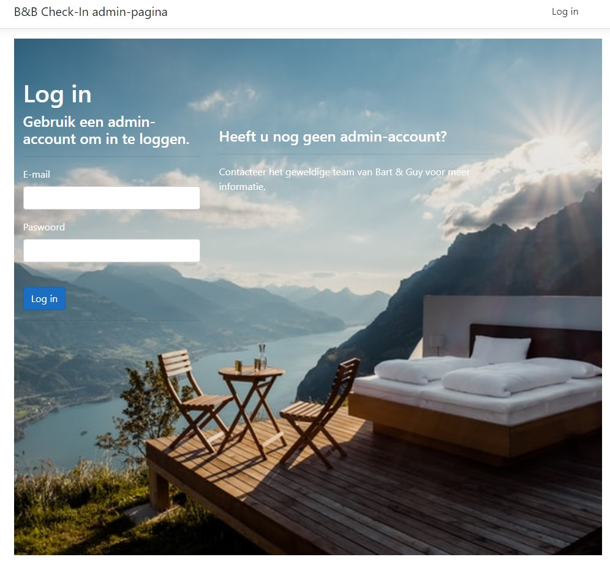

* Enkel de admin heeft de juiste privileges om de alle menu-items te bekijken en te bewerken.
---

Overzicht van gemaakte B&B's in de admin-pagina:
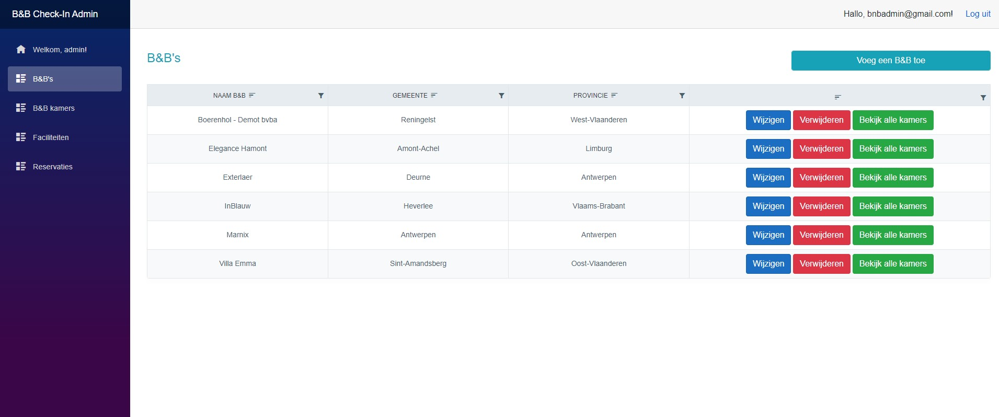

* Hier kan de admin B&B's gaan toevoegen, wijzigen en verwijderen. 
* Tevens is er een upload-module voor foto's toe te voegen aan de B&B. 
* Er is ook een rechstreekse knop naar alle kamers die verbonden zijn aan deze B&B. 
* Het vermelden waard is het gebruik van RichTextFields bij de beschrijving van de B&B. 
---

"Wijzig Kamer" in de admin-pagina:
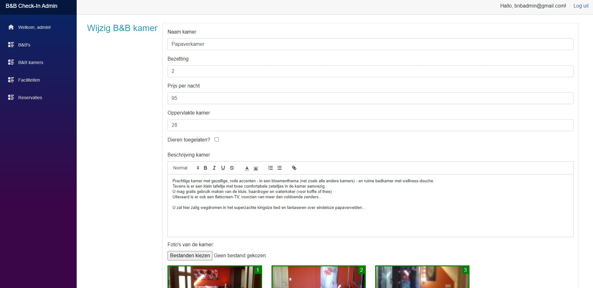

* Admin kan hier alle gegevens van de kamer aanpassen, foto's toevoegen en/of verwijderen.
* Hier ook een RichTextField voor de beschrijving.
---

"Reservatiedetails" in de admin-pagina:
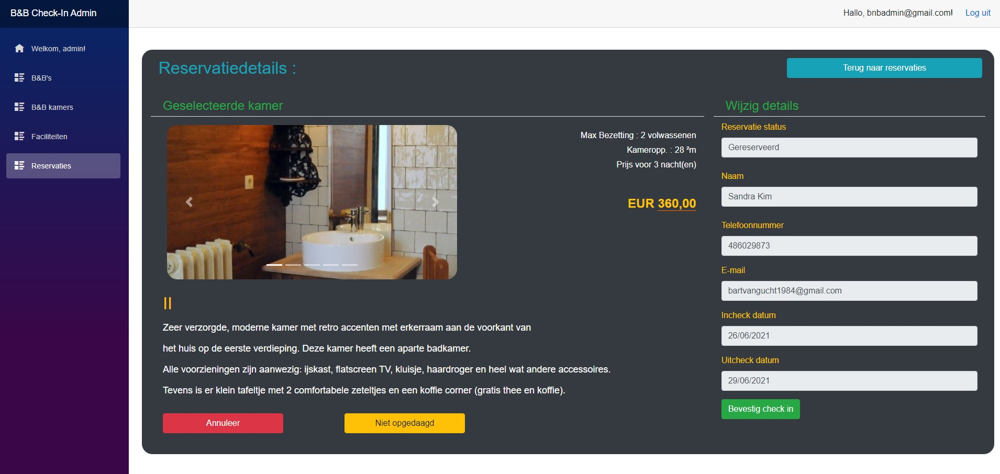

* Voorbeeld van een B&B-reservatie-formulier: hier kan de admin nog wijzigen gaan toepassen en zelfs de volledige reservatie gaan annuleren of aangeven dat de klant niet is komen opdagen.
---

### 2. De WebAPI

Overzicht van alle calls in de WebAPI:
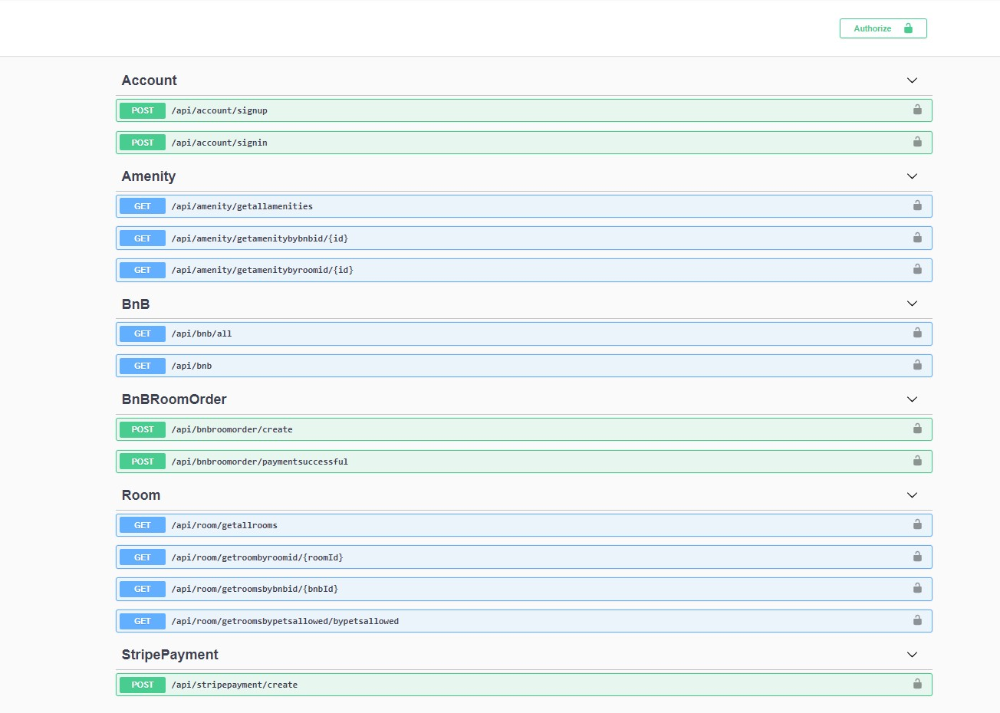

* Overzicht van alle methodes die in de APi zitten gecodeerd. Ongeveer de helft worden effectief aangesproken, de andere helft zijn voor toekomstige functionaliteiten.
---

"BnBGetAll"-call in de WebAPI:
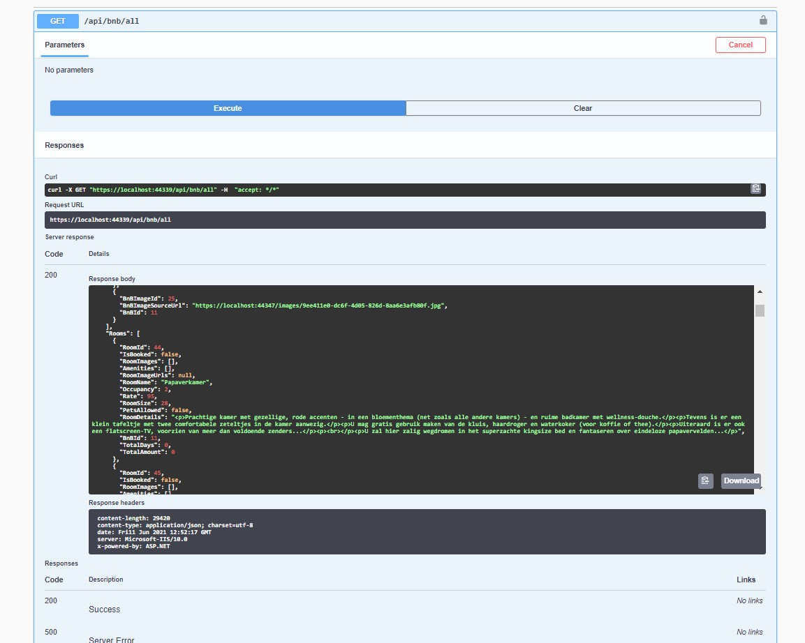

* Voorbeeldje van de API in werking bij het opvragen van een lijst van alle B&B's.
---

### 3. De frontend voor de eindgebruiker

"User Login" in de Client-side:
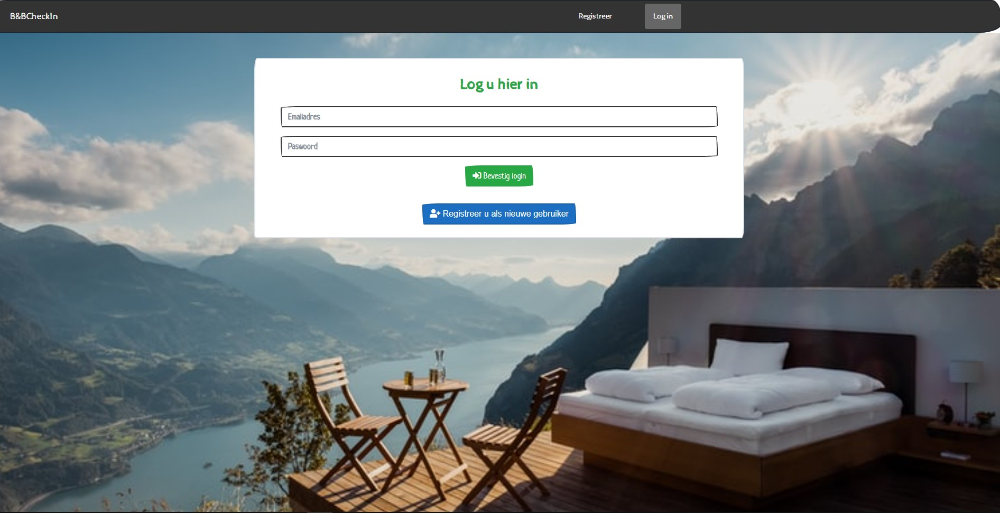

---

"Filtering zoekresultaten" in de Client-side:
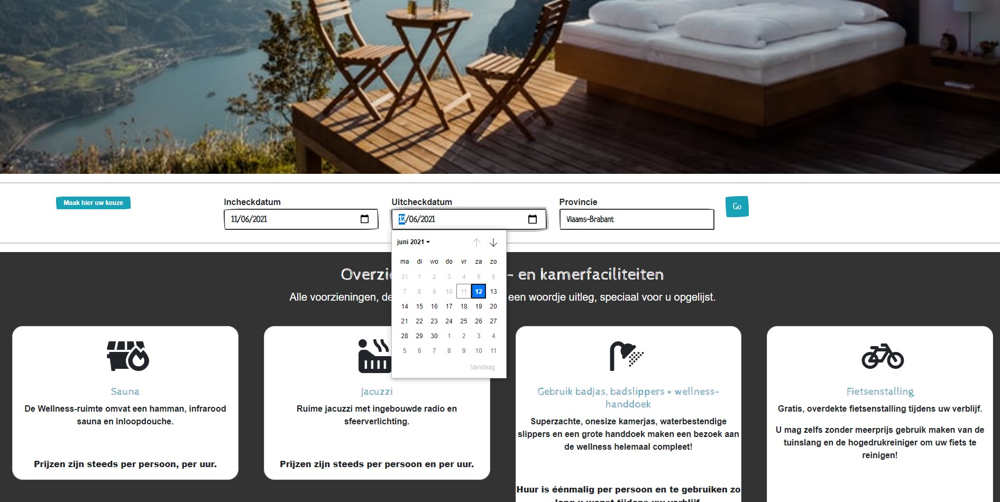

---

"Zoekresultaat B&B" in de Client-side:
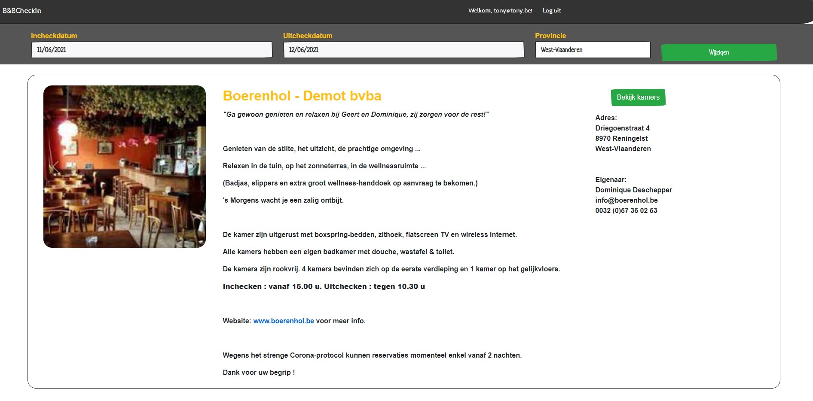

---

"Overzicht kamers bij specifieke B&B" in de Client-side:
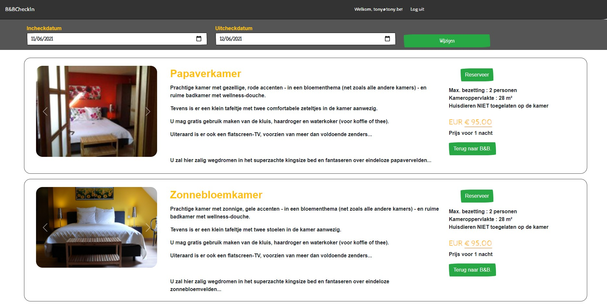

---

"Kamerdetails" in de Client-side:
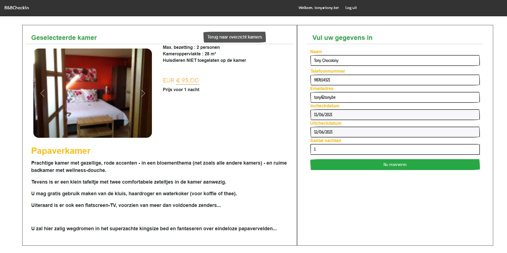

---

"User Stripe betaling" in de Client-side:

---

"E-mail payment confirmation" in de Client-side:
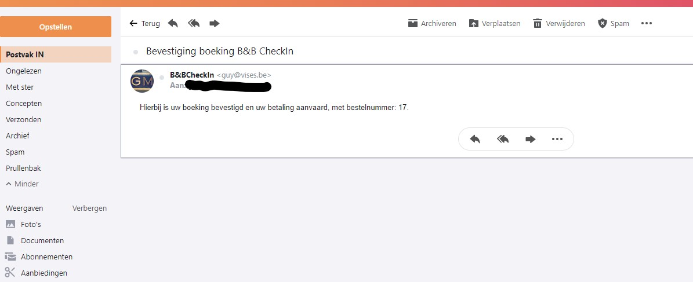

---

