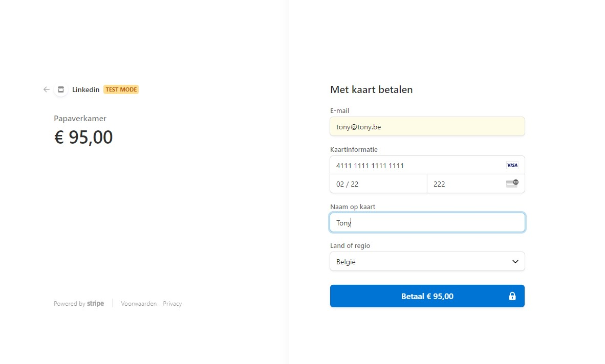

# B&B CheckIn Webapplicatie
Nederlandstalige webapplicatie die B&B's toelaat hun kamers online te laten aanbieden door een centrale admin en hun eindgebruikers in de gelegenheid stelt deze te bekijken, te filteren en te boeken.

Deze applicatie werd gemaakt door Bart Van Gucht en Guy Meuris in het kader van hun eindwerk voor de éénjarige, voltijdse dagopleiding "Software Developer .NET" aan het Syntra te Mechelen.

De B&B CheckIn app bestat uit drie delen:
	* Server-side: de adminpagina is gemaakt in Blazor_Server
	* ASP.NETCore 5.0 WebApi: afhandeling van de http-calls uit Client-side.
	* Client-side: de front-end pagina's die de eindgebruiker in staat stelt de app te gebruiken en boekingen te realiseren is gemaakt met Blazor_WASM.

OM de admin te gebruiken dient men ingelogd te zijn met de volgende gegevens: 
(hardcoded in de UserRolesConfiguration.cs)
Email = "bnbadmin@gmail.com",
Password = "BbAdmin123+"

### Gedetailleerd overzicht
* Het inlogscherm van de admin-page:

* Overzicht van gemaakte B&B's in de admin-pagina:

* "Wijzig Kamer" in de admin-pagina:

* "Reservatiedetails" in de admin-pagina:

* Overzicht van alle calls in de WebAPI:

* "BnBGetAll"-call in de WebAPI:

* "User Login" in de Client-side:

* "Filtering zoekresultaten" in de Client-side:

* "Zoekresultaat B&B" in de Client-side:

* "Overzicht kamers bij specifieke B&B" in de Client-side:

* "Kamerdetails" in de Client-side:

* "User Stripe betaling" in de Client-side:

* "E-mail payment confirmation" in de Client-side:

